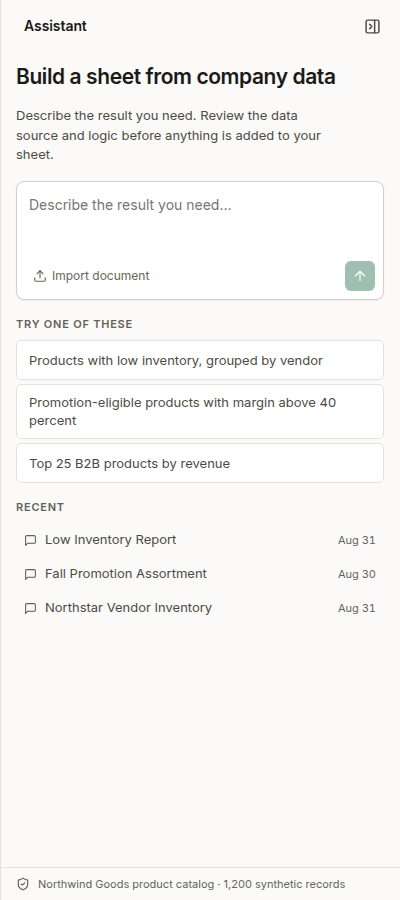
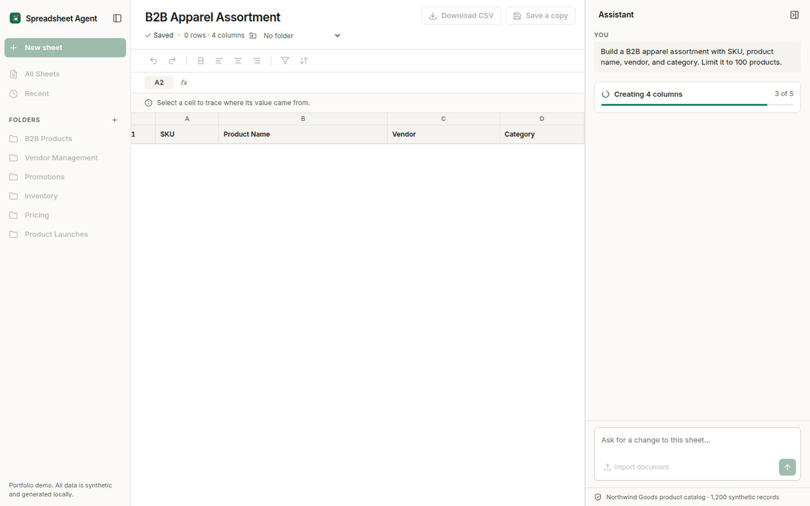
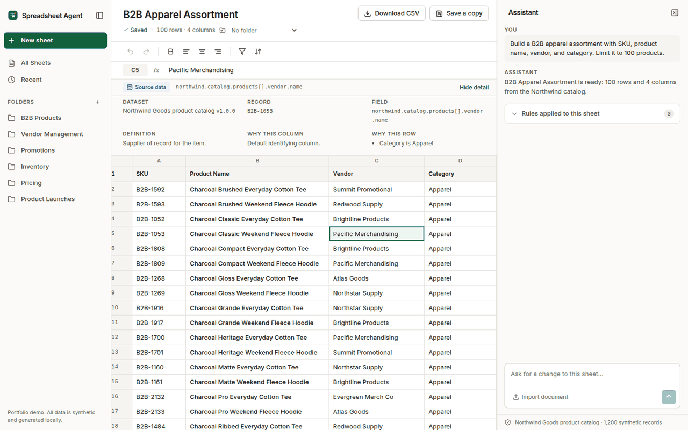
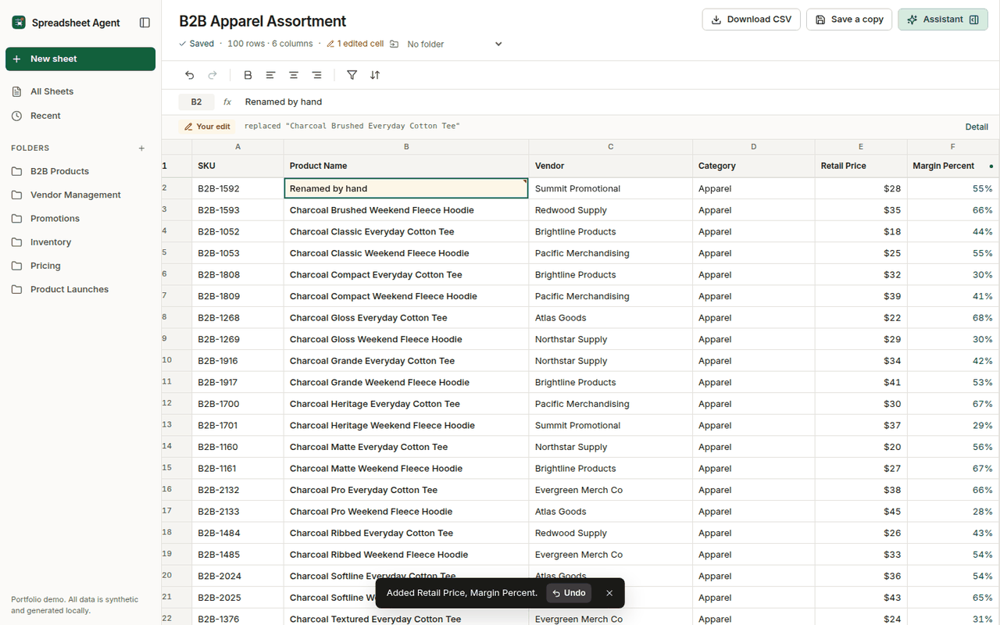

# Spreadsheet Agent

An AI-assisted spreadsheet workspace. You describe the sheet you need in plain
language, the agent turns that into a **query plan**, runs it against a
synthetic product catalog, and builds the sheet in front of you. Every value in
the result can be traced back to the record and field it came from.

The spreadsheet is the product. The assistant is a fixed panel beside it that
pushes the grid rather than covering it, and nothing reaches a sheet until you
have read and approved the plan.

[Query plan](#the-query-plan) · [Source references](#source-references) · [Running it](#running-it) · [Limitations](#limitations)

<!-- Add the live demo link here once the site is deployed. -->

> **This is a personal portfolio project.** It is a reconstruction built from
> scratch, in my own time, on invented data. It is not affiliated with, derived
> from, or a copy of any employer's product, codebase, or internal system. The
> company, catalog, vendors, products and contact addresses are all fictional
> and generated by [`src/lib/data.ts`](src/lib/data.ts). There is no database,
> no API, no authentication and no model behind it.


---

## What it does

|                                         |                                                                                                                                       |
| --------------------------------------- | ------------------------------------------------------------------------------------------------------------------------------------- |
| **Natural-language sheet creation**     | Describe a business outcome; the assistant interprets it into a plan                                                                  |
| **A reviewable build plan**             | Source, filters, columns, sort and row limit, each editable, before a single row is written                                           |
| **Visible construction**                | Named stages, columns first, then rows in controlled batches                                                                          |
| **Source references**                   | Select any cell to see the dataset, record id, field path, definition, why that column is present and which filters selected that row |
| **Three kinds of value, distinguished** | Catalog data, calculated values and your own edits are marked differently in the grid and in the provenance strip                     |
| **Previewed changes**                   | A change to an existing sheet shows its row and column delta before it applies, and is undoable afterwards                            |
| **CSV import and export**               | Import CSV, TSV, TXT or DOCX in the browser; export with formula-injection escaping                                                   |
| **Real states**                         | Distinct loading, empty, error and unsupported-request states throughout                                                              |



The starting state asks one question and offers three ways to answer it. Document
import is secondary; there is no second form, no recent-conversation list, and
no competing call to action.

---

## The query plan

The interpreter is a deterministic rule engine, not a language model. Rather
than hide that behind a spinner, the app puts the plan in front of you and waits.

For the request _"Build a B2B apparel assortment with SKU, product name, vendor,
and category. Limit it to 100 products."_ the panel shows:

|             |                                           |
| ----------- | ----------------------------------------- |
| **Source**  | Northwind product catalog · 1,200 records |
| **Filter**  | Category equals Apparel                   |
| **Columns** | SKU, Product Name, Vendor, Category       |
| **Sort**    | Product Name                              |
| **Limit**   | 100 rows                                  |

Every section is editable. Remove a filter, add or drop a column, change the
sort, lift the limit: the matching row count updates as you go, and **Build
sheet** runs the plan you ended up with rather than the sentence you started
with. Words the parser did not understand are listed rather than silently
ignored.

Once the sheet exists the plan collapses into "Rules applied to this sheet",
still attached to the result. The raw object sits behind a "Technical detail"
disclosure rather than a JSON button in the main interface.



Interpretation happens in two separate phases, in
[`src/lib/query.ts`](src/lib/query.ts):

```ts
buildPlan(request)  →  QueryPlan   // reads no rows, only decides what to do
executePlan(plan, rows)  →  Product[]   // applies the plan, pure
```

The resulting `QueryPlan` is a typed object that records the source and how many
rows it scanned, every filter clause with the **exact phrase in your request
that produced it**, the sort and any limit, every column with the reason it was
included, and any words the parser did not understand. That plan is attached to
the sheet and rendered in the panel.

```json
{
  "source": "catalog",
  "intent": "create",
  "filters": [
    {
      "field": "Category",
      "operator": "equals",
      "value": "Drinkware",
      "label": "Category is Drinkware",
      "matchedPhrase": "drinkware"
    },
    {
      "field": "Inventory",
      "operator": "lt",
      "value": 50,
      "label": "Inventory below 50",
      "matchedPhrase": "low inventory"
    }
  ],
  "sort": { "field": "Inventory", "direction": "asc" },
  "columns": [
    { "field": "SKU", "reason": "base", "sourcePath": "northwind.catalog.products[].sku" }
  ],
  "unmatchedTerms": [],
  "scannedRows": 1200,
  "matchedRows": 49
}
```

`runPlan()` is the third piece. It executes a plan a person has edited, at which
point the plan rather than the original sentence is the source of truth.

**Why this matters.** A deterministic planner you can read beats a simulated one
you cannot, and a review step turns "the assistant did something to my data"
into "I approved this". It also makes the migration path obvious: an LLM or a
server-side planner can replace phase one without touching the review step, the
grid, the execution layer or the provenance layer, because the contract between
them is this object.

---

## Source references

Select any cell and the strip above the grid says where the value came from.



[`src/lib/provenance.ts`](src/lib/provenance.ts) resolves a cell to one of five
kinds:

- **dataset** — a stored field, with record id, field path, and the field's definition
- **derived** — a computed field, with the formula (`Margin Percent` is `(Retail Price − Cost) ÷ Retail Price × 100`)
- **edited** — you typed over it, shown alongside the dataset value it replaced
- **document** — from a file you imported, with file name and row
- **empty** — nothing there, said plainly rather than guessed at

Nothing is stored per cell. Provenance is derived by comparing the sheet against
the record it was built from, which keeps saved sheets small and means edits are
detected rather than tracked.

The three kinds are distinguished in the grid itself, never by colour alone:
calculated columns carry a dot in the header and a tinted value, edited cells
carry a corner marker and a count in the page header.



---

## Running it

Requires Node 20.9 or newer.

```sh
npm ci
npm run dev          # http://localhost:4173
```

```sh
npm run check        # typecheck + lint + tests + production build
npm test             # 50 tests
npm run build        # static export to out/
```

There is nothing to configure. [`.env.example`](.env.example) exists to document
that fact and to sketch what a server-backed version would need.

---

## Architecture

Next.js App Router, static export, React 19, TypeScript in strict mode. One
route. Everything runs in the browser; there is no server and no network call
anywhere in `src/`.

```
src/
  app/            route, metadata, stylesheet entry point
  lib/            pure logic, no React
    data.ts       deterministic synthetic catalog + field metadata
    types.ts      domain types, including QueryPlan
    query.ts      request → plan → rows, plus runPlan for edited plans
    provenance.ts cell, row and column source resolution
    insights.ts   one meaningful result line per saved sheet
    csv.ts        export with formula escaping
    importDocument.ts   CSV/TSV/TXT/DOCX extraction
    catalogStorage.ts   localStorage codec
    animations.ts, layoutTransition.ts
  hooks/          state, all React
    useWorkspace.ts       sheets, undo/redo, persistence
    useGeneration.ts      interpret → review → build, and change previews
    useAssistantPanel.ts  panel width, open state, pointer + keyboard resize
    useChats.ts
  components/
    Workspace.tsx         shell and orchestration
    OverflowMenu.tsx, SheetDialog.tsx, ErrorBoundary.tsx, Sidebar.tsx
    sheet/                header, toolbar, formula bar, cell detail, grid
    assistant/            panel, plan review, applied plan, change preview,
                          build progress, document import
    library/              sheet list and file actions
  styles/         tokens, base, layout, sheet, assistant, library
```

The dependency direction is one way: `components → hooks → lib`. Nothing in
`lib/` imports React, which is why the interpreter and provenance layer are
testable as plain functions.

---

## Product decisions

**The spreadsheet stays primary.** The assistant is a fixed panel in the app's
grid, not a floating window. Opening, closing and dragging its edge reflow the
sheet rather than covering it, and the width you choose is remembered. Minimised,
it becomes one control in the page header, not a floating pill over the data.
The grid always consumes the width that is left.

**Nothing is written without approval.** A request produces a plan, not a sheet.
Changes to an existing sheet show their row and column delta first and are
undoable afterwards. Toolbar filter and sort route through the same interpreter,
so the plan and the source references stay accurate however the change was
started.

**Show the mechanism instead of implying intelligence.** An earlier version of
this idea printed "Connecting to database" during a fixed delay. There is no
database. The stages now name real work — checking approved sources, applying
two filters, creating four columns, adding 100 matching products — and columns
appear before rows so the shape of the sheet is legible before it fills.

**Green means something.** It is used for selection, active navigation, primary
actions and successful completion, and nowhere else. Status is never carried by
colour alone: every state has an icon or a word beside it.

**Ambiguity gets refused, not guessed.** A request with contradictory limits
("margin under 40 and margin above 60") returns a fixable message rather than an
empty sheet. A command the parser did not understand leaves the open sheet
untouched. Words it ignored are listed in the plan under "not understood".

**Edits belong to the user.** Manual edits survive filtering, sorting, adding and
removing columns. They are never written back to the dataset, are visibly marked,
and are reported as yours in the source panel.

**Synthetic data is a feature, not a limitation.** 1,200 records generated by a
pure function means tests, screenshots and the live demo always agree, and there
is no scenario in which this repository leaks anything real.

**1,200 rows, not 5,000.** Enough to make pagination and filtering meaningful,
small enough that the live preview under the composer recomputes on every
keystroke without lag.

---

## Testing

56 tests over the logic that would actually break something, run with
`node:test` and `tsx`:

- **Query** (18) — filter combination, threshold parsing in both word orders, impossible-range detection, sort direction, `top N`, column inference and override, clause-to-phrase mapping, unmatched-term reporting, and that `executePlan` is pure and does not mutate the catalog
- **Provenance** (8) — dataset, derived, edited, document and empty resolution; every row satisfying the clauses that selected it; every column carrying its reason
- **CSV** (4) — round trip with edited values, column order, formula-injection escaping, internal ids never leaking, filename sanitising
- **Import** (6) — quoted commas, leading zeros preserved as text, duplicate headers, labeled-record extraction, size and type rejection, and that imported sheets never fall back to the catalog
- **Plan execution** (8) — the documented demo plan, limits without a sort, an edited plan overriding the original request, `countForPlan` agreeing with `runPlan`, and the catalog surviving both
- **Insights** (7) — every seeded sheet producing a readable result line, sheets differing in size, row counts agreeing with their plans
- **Layout** (5) — single-commit layout transitions

Three real bugs were found by writing and running these: `executePlan` returned
references into the shared catalog, so editing one cell rewrote the dataset for
every other sheet; an unrecognised command against an open sheet was accepted
whenever it happened to contain a word like "everything"; and undo history was
pushed from inside a state updater, which left the undo control one commit
behind and risked a double push.

CI runs typecheck, lint, tests and build on every push.

---

## Accessibility and responsive behaviour

- Zero violations from axe-core (WCAG 2.1 A and AA) on both main views
- The whole primary flow is keyboard operable: a skip link reaches the assistant directly, Enter submits, Tab reaches **Build sheet**, and the panel resizes with the arrow keys (Home resets it)
- Build progress and completion are announced through a polite live region
- Full keyboard operation of the grid: arrows, Tab, Enter, F2, Escape, Delete
- Focus trapped in dialogs and returned to the opener on close
- Every icon-only control has a label and a tooltip, with hit areas of at least 40px
- Status is never colour alone
- All motion respects `prefers-reduced-motion`, which collapses build delays to zero and skips the row animation
- Optimised for 1440px. Below 1200px navigation becomes an icon rail and header actions collapse into an overflow menu; the library list sheds columns by container width. Only the spreadsheet scrolls horizontally, never the page.


---

## Limitations

Stated plainly, because a portfolio project that oversells itself is worse than
one that does less.

- **No model and no server.** The interpreter is rules. It handles the request
  shapes documented above and refuses the rest. It does not generalise.
- **The formula bar edits values.** It does not evaluate spreadsheet formulas.
- **Storage is local.** Sheets live in this browser's `localStorage`. They do not
  sync, and clearing site data removes them. Imported document contents are
  stored there too until you delete the sheet.
- **Imported sheets are limited.** Structural commands only — sort and remove
  column. They are not connected to the catalog, so catalog filters do not apply.
- **One worksheet per sheet.** No tabs, no multi-cell selection, no column
  resizing, no rich formatting beyond bold and alignment.
- **CSV export preserves data, not formatting.**
- **No collaboration.** There are no accounts and no real sharing. The "Shared with me" view is seeded with sheets attributed to fictional colleagues so the navigation is complete; the view says so in its own subtitle. Permissions and multiplayer are out of scope.
- **Starring and the bin are real but local.** A starred sheet and a deleted one persist in this browser's storage like everything else, and nothing syncs.

### What a production version would need

`interpret()` is the boundary. A server replacing it should authenticate the
user, authorise data sources and fields by role, validate the plan before
executing it, run only parameterised queries against approved sources, and return
only permitted rows and columns. Credentials and any model keys stay server-side.
The plan, the identity and the resulting changes get written to an audit log.
Provenance already has the right shape for that: the client renders whatever
source the server attests to.

The current build has no such guarantees and does not claim any. Everything it
touches is public synthetic data.

---

## Credits

Built by [Harlie Katz](https://harliekatz.netlify.app). Icons by
[Lucide](https://lucide.dev), animation by [GSAP](https://gsap.com), CSV parsing
by [Papa Parse](https://www.papaparse.com), DOCX reading by
[Mammoth](https://github.com/mwilliamson/mammoth.js). Inter is bundled locally,
so the app loads no third-party resources at runtime.

[MIT licensed](LICENSE).
