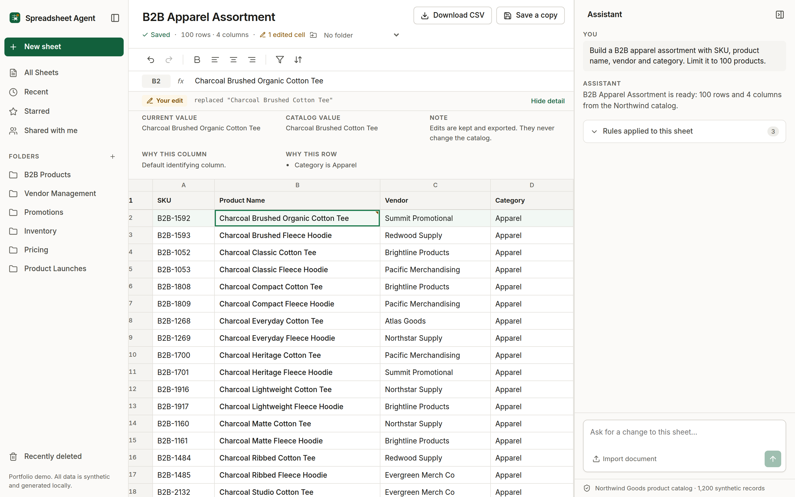
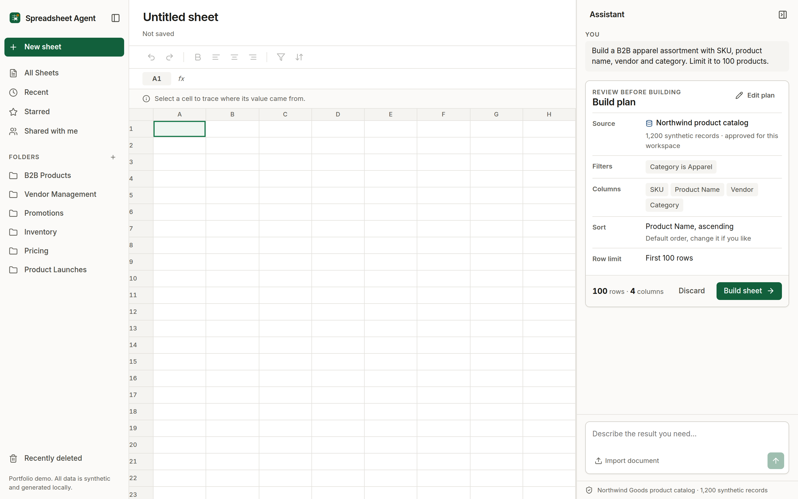

# Spreadsheet Agent

A merchandising workspace where you describe the sheet you need in plain language, review the logic before anything runs, and then edit the result like a normal spreadsheet. Every value can be traced back to the record and field it came from.

**Demo.** [spreadsheet-agent.netlify.app](https://spreadsheet-agent.netlify.app)



## What it does

**Turns a request into a plan you approve first.** Type something like "B2B apparel assortment with SKU, product name, vendor and category, limit 100 products". The app parses that into a structured query plan showing the source, filters, columns, sort and row limit. You can edit any part of the plan or discard it. Nothing is added to a sheet until you approve.



**Traces every value to its origin.** Click a cell and the panel names the dataset, the record id and the field path that produced it, along with the filter clause that selected the row. Values you type over are marked as edits and keep their previous value.

**Behaves like a spreadsheet.** Cells are editable, changes undo and redo, sheets go into folders, and any sheet exports to CSV. You can also import a `.docx`, `.csv`, `.tsv` or `.txt` file and build a sheet from its contents.

## How requests are interpreted

Interpretation is rule based. [`src/lib/query.ts`](src/lib/query.ts) matches the request against a fixed set of patterns for fields, filters, sorts and limits, and emits a typed `QueryPlan`. There is no language model, no API key and no network call anywhere in the application.

The plan is the reason this matters. Because interpretation produces a structured object rather than rows directly, the plan can be displayed, edited and attached to the sheet, which is what makes a value traceable afterward. A model based planner could replace that first step without touching the executor, the grid or the source layer.

## Why I built it

At PlanetArt I worked in product operations and merchandising, where assortment and pricing work meant rebuilding the same spreadsheets by hand from several systems. I developed the concept for an internal spreadsheet workspace that would let merchandising users assemble and edit sheets from approved data, and presented it to engineering.

This repository is my own reconstruction of that idea, built from scratch outside of work on invented data. It shares no code, schema or data with any employer system. The catalog, vendors, products and contact addresses are generated by [`src/lib/data.ts`](src/lib/data.ts).

## Run it locally

```bash
npm install
npm run dev      # http://localhost:3000
```

```bash
npm test         # 59 tests
npm run check    # typecheck, lint, test, build
npm run build    # static export to out/
```

No environment variables are needed. [`.env.example`](.env.example) documents that the app takes no configuration.

## Implementation notes

- [Architecture](docs/architecture.md) covers the two phase interpreter, the executor and how state is held.
- [Value sources](docs/value-sources.md) explains the five source classifications, the two markers used in the grid, and how edits are detected.
- [Testing](docs/testing.md) lists what the suite covers and what it does not.
- [Limitations](docs/limitations.md) covers the interpreter's coverage, local only storage and the synthetic catalog.

## License

MIT, see [LICENSE](LICENSE). Built by [Harlie Katz](https://harliekatz.netlify.app). All data in this application is synthetic.
